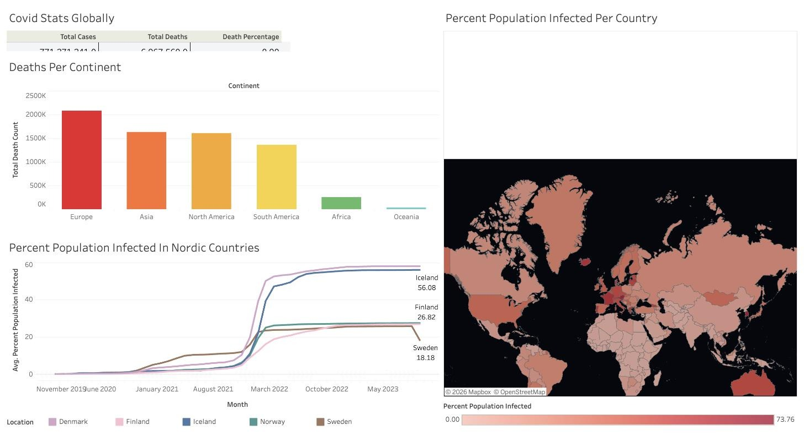

# COVID-19 Data Analysis (SQL + Tableau)

How hard did COVID-19 hit different parts of the world, and how did Finland compare with its Nordic neighbours? This project answers those questions by exploring global COVID-19 death and vaccination data in SQL Server and presenting the results in an interactive Tableau dashboard.

## Dashboard

**[View the interactive dashboard on Tableau Public →](https://public.tableau.com/app/profile/abir.hossain4647/viz/CovidDataVisualization_17138742015650/Dashboard1)**

The dashboard has four parts: global totals (cases, deaths and death percentage), total deaths per continent, the share of the population infected in each Nordic country over time, and a world map coloured by the share of each country's population that was infected.

## Key findings
- **Europe recorded the most deaths** of any continent (about 2.1 million), followed by Asia, North America and South America (each 1.3–1.6 million). Africa and Oceania were far lower.
- **Infections in the Nordic countries jumped sharply in early 2022.** Before that, every Nordic country stayed below about 15% of the population infected.
- **Finland ended up much lower than Denmark and Iceland.** In the latest data, about 27% of Finland's population had been recorded as infected, compared with about 56% in Iceland and a similar level in Denmark.

## Data
Two public tables from [Our World in Data](https://ourworldindata.org/coronavirus): one with daily COVID-19 cases and deaths and one with vaccinations, both by country and date.

## What I did
- Loaded both tables into SQL Server and explored them
- Calculated the death rate (deaths ÷ cases) and the share of the population infected, first for Finland and then for every country
- Ranked countries and continents by highest infection rate and total death count, filtering out non-geographic groupings such as income levels
- Joined the deaths and vaccinations tables and used a window function (`SUM() OVER (PARTITION BY ...)`) to build a running total of vaccinations per country
- Showed the same calculation as both a CTE and a temp table, and saved it as a view for visualisation
- Built the Tableau dashboard from the query results

## Files
| File | Description |
|---|---|
| `SQLQuery5 v2.sql` | All SQL queries, with comments explaining each step |
| `Tableau visualization link` | Link to the dashboard on Tableau Public |
| `images/` | Dashboard screenshot |

## Tools
SQL Server (SSMS), Tableau
